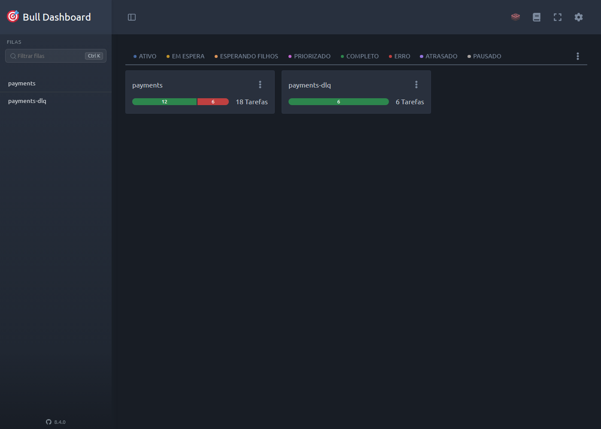

# queue-worker

API em NestJS que enfileira pagamentos e os processa de forma assíncrona com BullMQ, lidando com falha, reprocessamento, duplicidade e visibilidade operacional.



## Stack

- NestJS + TypeScript
- BullMQ + Redis
- Bull Board (painel em `/admin/queues`)
- Swagger (`/docs`)
- Docker Compose (Redis)
- Jest + Supertest

## Decisões de arquitetura

**Por que fila em vez de processamento síncrono?** Cobrar um pagamento depende de um gateway externo, lento e sujeito a falha. Fazer isso dentro do request HTTP prende a conexão do cliente durante toda a chamada e transforma qualquer instabilidade do gateway em erro na cara do usuário. Enfileirando, a API responde 202 na hora e o trabalho pesado roda em background, onde pode ser retentado sem o cliente perceber. A fila ainda dá controle de vazão: um pico de mil pagamentos espera a vez em vez de derrubar o gateway.

**Por que backoff exponencial e não retry imediato?** A maioria das falhas de gateway é transitória — timeout, indisponibilidade momentânea, rate limit. Retentar no mesmo instante só empilha carga sobre um serviço que já está sofrendo, e costuma falhar de novo. O backoff exponencial (1s, 2s, 4s, 8s) espaça as tentativas, dá tempo de o gateway se recuperar e evita efeito manada quando muitos jobs falham juntos.

**Por que dead-letter queue em vez de descartar o job?** Um pagamento que falhou cinco vezes ainda é um pagamento. Descartar é perder dinheiro e o rastro do que aconteceu. A DLQ tira o job do fluxo principal — que não pode ficar travado — mas preserva o payload e o motivo da última falha, prontos para inspeção ou reprocessamento manual. É a diferença entre "sumiu" e "está aqui, parado, com o erro anotado".

**Por que idempotência é obrigatória em fila?** BullMQ, como toda fila séria, entrega pelo menos uma vez (at-least-once): um job pode rodar mais de uma vez se o worker cai no meio, se há reentrega ou se o cliente reenvia a requisição. Sem proteção, isso vira cobrança dupla. Cada pagamento carrega um `eventId`; antes de cobrar, o worker registra esse id e, se já o viu, pula o processamento. A cobrança acontece uma vez, não importa quantas vezes o job seja executado.

**Por que `SET NX` e não checagem em duas etapas?** A tentação é fazer um `GET` para ver se o `eventId` existe e, se não, um `SET`. Mas entre o `GET` e o `SET` dois workers podem ler "não existe" e ambos processarem — condição de corrida. `SET key value NX` é atômico: o Redis só grava se a chave ainda não existe e devolve numa única operação quem ganhou a disputa. Não há janela entre checar e gravar.

## Como rodar

```bash
docker compose up -d
npm install
cp .env.example .env
npm run start:dev
```

## Endpoints

| Método | Rota | Descrição |
|---|---|---|
| POST | `/payments` | Enfileira um pagamento e retorna 202 |
| GET | `/admin/queues` | Painel do Bull Board (filas e DLQ) |
| GET | `/docs` | Documentação Swagger da API |

## Exemplo de fluxo

Enfileirar um pagamento. O `eventId` é um UUID gerado pelo cliente e serve de chave de idempotência:

```bash
curl -X POST http://localhost:3000/payments \
  -H "Content-Type: application/json" \
  -d '{"eventId":"550e8400-e29b-41d4-a716-446655440000","amount":2500,"currency":"BRL"}'
# 202 Accepted
# {"paymentId":"...","status":"queued"}
```

Reenviar o mesmo `eventId` enfileira outro job, mas o worker pula o processamento por já ter visto o evento — o pagamento é cobrado uma vez só.

Para ver um job cair na dead-letter queue, suba a API com o gateway sempre falhando:

```bash
GATEWAY_FAILURE_RATE=1 npm run start:dev
```

Qualquer pagamento enfileirado vai falhar, ser retentado cinco vezes com backoff exponencial e, esgotadas as tentativas, aparecer na fila `payments-dlq` com o motivo da falha. Acompanhe tudo em `/admin/queues`.

## Próximos passos

- Persistir o resultado dos pagamentos num banco de dados. Hoje o que sobra é o estado das filas no Redis, não um histórico consultável.
- Endpoint para reprocessar jobs da DLQ, que por enquanto só são inspecionáveis pelo painel.
- Autenticação em `/payments` e `/admin/queues`. A API e o painel estão abertos.
